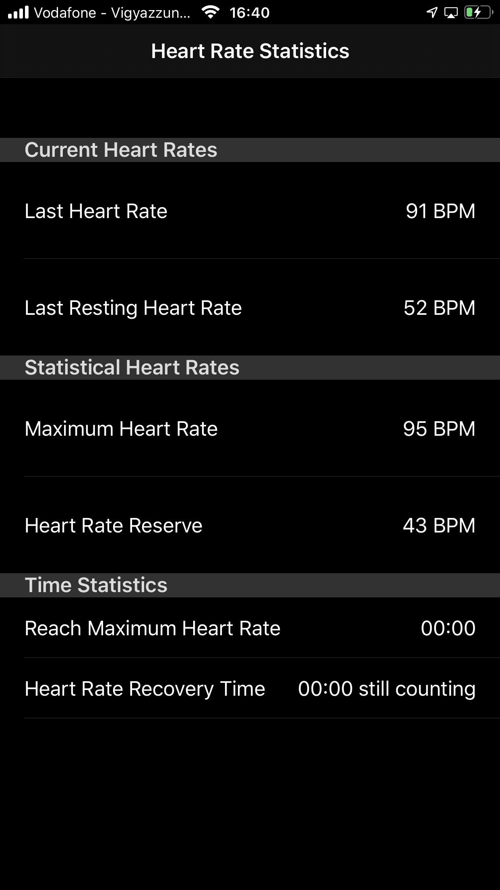
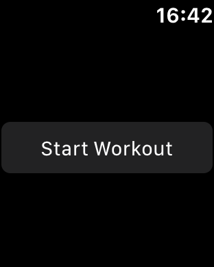

# Apple-Watch-Szivkovetes
Az Apple Watch alkalmas folyamatos szívfrekvencia monitorozására különböző sporttevékenységek (séta, futás, biciklizés, stb.) közben.

Részletek és funkcionális specifikáció:A feladat olyan mobil applikáció elkészítse, amely:
•        ki tudja olvasni ezen adatokat az Apple okosórájából
•        kiír, kiszámol néhány fontos sportolás közbeni szívfrekvenciaparamétert:
o        nyugalmi pulzus
o        maximális pulzus
o        pulzustartalék (a nyugalmi pulzus és a maximális pulzus közötti különbség)
o        mennyi idő múlva érte el a max. pulzust
o        mennyi idő kellett a sporttevékenység után a nyugalmi pulzusra való visszatérésre

Felelős fejlesztő: Renyák Dávid István (david.renyak@outlook.com)
